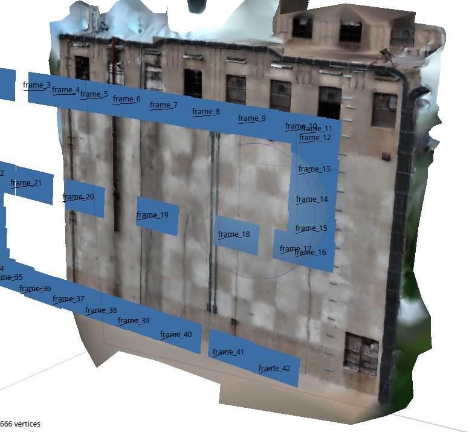

<h1> Мопс </h1>

Мониторинг и Обследование Поверхностей Сооружений (МОПС) - Проект разработанный при поддержке компании Геоскан для оптимизации обследования сооружений с использованием беспилотной авиации.


## Содержание

- [Бекенд](#бекенд)
    - [Metashape](#metashape)
    - [YOLO](#yolo)
- [Фронтенд](#фронтенд)
  - [Основные возможности фронтенда:](#основные-возможности-фронтенда)
- [Установка и запуск](#установка-и-запуск)
  - [Требования](#требования)
    - [Для бекенда:](#для-бекенда)
    - [Для фронтенда:](#для-фронтенда)
  - [Бекенд](#бекенд-1)
  - [Фронтенд](#фронтенд-1)
- [Структура проекта](#структура-проекта)
- [API эндпоинты](#api-эндпоинты)
  - [Сессии](#сессии)
  - [Загрузка данных](#загрузка-данных)
  - [Обработка](#обработка)
- [Использование](#использование)
  - [Рабочий процесс](#рабочий-процесс)
  - [Особенности обработки](#особенности-обработки)
  - [Переменные окружения](#переменные-окружения)
    - [Бекенд:](#бекенд-2)
    - [Фронтенд:](#фронтенд-2)
- [Бекенд](#бекенд-3)
  - [Технологии](#технологии)
  - [Архитектура](#архитектура)
    - [Основные модули](#основные-модули)
  - [Обработка изображений](#обработка-изображений)
    - [Процесс Metashape](#процесс-metashape)
    - [Процесс YOLO](#процесс-yolo)
  - [Обработка ошибок](#обработка-ошибок)
  - [Производительность](#производительность)
- [Фронтенд](#фронтенд-3)
  - [Технологии](#технологии-1)
  - [Архитектура компонентов](#архитектура-компонентов)
    - [App.jsx](#appjsx)
    - [Header](#header)
    - [Sidebar (LeftPanel)](#sidebar-leftpanel)
    - [ImageViewer](#imageviewer)
    - [Loader](#loader)
  - [Управление состоянием](#управление-состоянием)
  - [Стилизация](#стилизация)
- [Разработка](#разработка)
  - [Запуск в режиме разработки](#запуск-в-режиме-разработки)
    - [Бекенд](#бекенд-4)
    - [Фронтенд](#фронтенд-4)
  - [Сборка для продакшена](#сборка-для-продакшена)
    - [Бекенд](#бекенд-5)
    - [Фронтенд](#фронтенд-5)
- [Устранение неполадок](#устранение-неполадок)
  - [Проблемы с бекендом](#проблемы-с-бекендом)
    - [Модель YOLO не найдена](#модель-yolo-не-найдена)
    - [Metashape недоступен](#metashape-недоступен)
    - [Ошибка подключения к дрону](#ошибка-подключения-к-дрону)
  - [Проблемы с фронтендом](#проблемы-с-фронтендом)
    - [CORS ошибки](#cors-ошибки)
    - [Изображение не загружается](#изображение-не-загружается)
- [Лицензия](#лицензия)
- [Контакты и поддержка](#контакты-и-поддержка)
- [Благодарности](#благодарности)


# Бекенд

Бекенд сайта написан на Python и фреймворке FastAPI.
Обработка полученных фотографий реализована при помощи библиотеки Metashape и дообученной на поиск трещин модели YOLOv8X.

### Metashape

**Metashape** — это профессиональная программа для фотограмметрии (создание 3D-моделей, карт и облаков точек из обычных фотографий).

Python-библиотека Metashape позволяет управлять Metashape напрямую из Python-скриптов. В нашем случае библиотека используется для создания ортофотофасада - проекции фасада любого сооружения. Такое изображение позволяет избавиться от обьемности изображения и неидеальности ракурса сьемки
<!--  -->

### YOLO

Для реализации поиска трещин на полученном ортофотофасаде мы решили использовать нейросеть YOLOv8. Нами был найден проект [YOLOv8 for crack segmentation](https://huggingface.co/OpenSistemas/YOLOv8-crack-seg) который специально обучался решать такие задачи. Для лучшего результата была выбрана нейросеть с приставкой "X", ведь ее результаты самые точные, но время обработки немного увелиичилось. Для увеличения точности работы системы кадр перед обработкой делится на пересекающиеся секции и нейросеть ищет трещины в этих небольших секциях. Далее результаты обобщаются, часть найденных трещин будут обьедены, если находятся слишком близко.


# Фронтенд

Фронтенд написан на React с применением JavaScript и CSS. Интерфейс поддерживает светлую и темную темы, имеет современный дизайн с эффектами стекла (glassmorphism). 

## Основные возможности фронтенда:

- **Загрузка изображений**: Поддержка загрузки одного изображения для AI обработки или папки изображений для Metashape
- **Обработка в реальном времени**: Отображение процесса обработки с индикаторами загрузки
- **Просмотр результатов**: Полноэкранный просмотр обработанных изображений с возможностью масштабирования
- **Скачивание результатов**: Возможность скачать обработанное изображение
- **Управление дроном**: Кнопка для запуска полета дрона и сбора данных
- **Темная/светлая тема**: Переключение между темами с сохранением выбора

---

# Установка и запуск

## Требования

### Для бекенда:
- Python 3.8+
- Agisoft Metashape (для обработки фотограмметрии)
- Модель YOLO (`best.pt`) - должна находиться в папке `backend/` или путь указывается через переменную окружения `YOLO_MODEL_PATH`

### Для фронтенда:
- Node.js 16+
- npm или yarn

## Бекенд

1. Перейдите в папку бекенда:
```bash
cd backend
```

2. Создайте виртуальное окружение (рекомендуется):
```bash
python3 -m venv .venv
source .venv/bin/activate  # Для Windows: .venv\Scripts\activate
```

3. Установите зависимости:
```bash
pip install -r requirements.txt
```

4. Убедитесь, что файл модели YOLO `best.pt` находится в папке `backend/` или укажите путь через переменную окружения:
```bash
export YOLO_MODEL_PATH=/path/to/best.pt
```

5. (Опционально) Настройте параметры подключения к дрону через переменные окружения:
```bash
export DRONE_HOST=10.42.0.1  # IP адрес контроллера дрона
export DRONE_PORT=8089        # Порт контроллера
export DRONE_TIMEOUT=10       # Таймаут подключения в секундах
```

6. Запустите сервер:
```bash
python -m uvicorn main:app --host 0.0.0.0 --port 8000 --reload
```

Сервер будет доступен по адресу `http://localhost:8000`. Документация API доступна по адресу `http://localhost:8000/docs`.

## Фронтенд

1. Перейдите в папку фронтенда:
```bash
cd frontend
```

2. Установите зависимости:
```bash
npm install
```

3. (Опционально) Настройте URL бекенда через переменную окружения:
```bash
# Создайте файл .env в папке frontend
echo "VITE_API_BASE_URL=http://localhost:8000" > .env
```

4. Запустите dev-сервер:
```bash
npm run dev
```

Фронтенд будет доступен по адресу `http://localhost:5173`.

---

# Структура проекта

```
Geoscan_MOPS/
├── backend/                 # Бекенд приложения
│   ├── main.py            # Основной файл FastAPI приложения
│   ├── ai.py              # Модуль обработки изображений через YOLO
│   ├── metashape.py       # Модуль обработки через Metashape
│   ├── fly.py             # Модуль управления дроном
│   ├── grabber.py         # Модуль получения изображений
│   ├── requirements.txt   # Python зависимости
│   ├── best.pt            # Модель YOLO (необходимо добавить)
│   └── tmp/               # Временные файлы сессий
│       └── tmp{N}/        # Папки сессий
│           ├── data/      # Исходные изображения
│           ├── metashape/ # Результаты Metashape
│           └── ai/        # Результаты AI обработки
│
├── frontend/              # Фронтенд приложения
│   ├── src/
│   │   ├── App.jsx        # Главный компонент
│   │   ├── components/    # React компоненты
│   │   │   ├── header/    # Компонент заголовка
│   │   │   ├── leftPanel/ # Боковое меню
│   │   │   ├── imageViewer/ # Просмотрщик изображений
│   │   │   └── loader/    # Индикатор загрузки
│   │   └── assets/        # Статические ресурсы
│   └── package.json       # Node.js зависимости
│
└── README.md              # Этот файл
```

---

# API эндпоинты

## Сессии

- `GET /session/new` - Создать новую сессию
- `GET /session/current` - Получить ID текущей сессии

## Загрузка данных

- `POST /data/upload` - Загрузить изображения в папку `data/`
- `POST /data/upload-and-process-metashape` - Загрузить папку изображений, обработать через Metashape и AI
- `POST /data/upload-and-process-ai` - Загрузить одно изображение и обработать через AI

## Обработка

- `POST /start/fly` - Запустить полет дрона и сбор данных
- `GET /metashape/run?session_id={id}` - Запустить обработку Metashape + AI для существующей сессии
- `GET /ai/run?session_id={id}` - Запустить AI обработку для существующей сессии

Все эндпоинты возвращают обработанные изображения в формате `image/jpeg` или JSON с информацией о сессии.

Подробная документация API доступна по адресу `http://localhost:8000/docs` после запуска бекенда.

---

# Использование

## Рабочий процесс

1. **Запуск полета дрона**:
   - Нажмите кнопку "Старт полёта" в боковом меню
   - Система автоматически создаст сессию и запустит сбор данных

2. **Обработка папки изображений (Metashape + AI)**:
   - Нажмите "Загрузить папку (Metashape)"
   - Выберите несколько изображений
   - Система автоматически:
     - Создаст ортомозаику через Metashape
     - Обработает результат через AI для поиска трещин
     - Отобразит финальный результат

3. **Обработка одного изображения (AI)**:
   - Нажмите "Загрузить фото (AI)"
   - Выберите одно изображение
   - Система обработает изображение через YOLO и отобразит результат с найденными трещинами

4. **Скачивание результата**:
   - После обработки нажмите "Скачать изображение" в боковом меню
   - Изображение будет скачано с текущей датой и временем в имени файла

## Особенности обработки

- **Metashape**: Создает ортофотофасад из множества фотографий, устраняя искажения перспективы
- **YOLO**: Обрабатывает изображения по частям (тайлам) для повышения точности, затем объединяет результаты
- **Автоматическая цепочка**: При обработке через Metashape результат автоматически передается в AI

## Переменные окружения

### Бекенд:
- `YOLO_MODEL_PATH` - Путь к файлу модели YOLO (`best.pt`)
- `DRONE_HOST` - IP адрес контроллера дрона (по умолчанию: `10.42.0.1`)
- `DRONE_PORT` - Порт контроллера дрона (по умолчанию: `8089`)
- `DRONE_TIMEOUT` - Таймаут подключения в секундах (по умолчанию: `10`)

### Фронтенд:
- `VITE_API_BASE_URL` - URL бекенда (по умолчанию: `http://localhost:8000`)

---

# Бекенд

## Технологии

Бекенд построен на следующих технологиях:

- **FastAPI** - современный веб-фреймворк для создания API на Python
- **Uvicorn** - ASGI сервер для запуска FastAPI приложений
- **Metashape Python API** - библиотека для работы с Agisoft Metashape
- **Ultralytics YOLO** - библиотека для работы с моделями YOLO
- **OpenCV** - библиотека для обработки изображений
- **NumPy** - библиотека для численных вычислений

## Архитектура

Бекенд использует архитектуру на основе сессий. Каждая сессия представляет собой изолированную рабочую область с тремя основными папками:

- `data/` - исходные изображения, загруженные пользователем или полученные от дрона
- `metashape/` - результаты обработки через Metashape (ортомозаика, проекты)
- `ai/` - результаты обработки через YOLO (изображения с обнаруженными трещинами)

### Основные модули

- **main.py** - точка входа, содержит все API эндпоинты и логику управления сессиями
- **ai.py** - модуль обработки изображений через YOLO с поддержкой тайлинга и NMS
- **metashape.py** - модуль обработки фотограмметрии через Metashape API
- **fly.py** - модуль управления дроном через TCP/IP соединение
- **grabber.py** - модуль получения изображений от дрона

## Обработка изображений

### Процесс Metashape

1. Импорт фотографий в проект Metashape
2. Сопоставление фотографий (matching)
3. Выравнивание камер (alignment)
4. Построение карт глубины (depth maps)
5. Построение 3D модели
6. Построение DEM (Digital Elevation Model)
7. Построение ортомозаики
8. Экспорт результата

### Процесс YOLO

1. Разделение изображения на тайлы (пересекающиеся секции)
2. Обработка каждого тайла через YOLO модель
3. Объединение результатов с учетом смещений тайлов
4. Применение Non-Maximum Suppression (NMS) для удаления дубликатов
5. Отрисовка bounding boxes на исходном изображении
6. Сохранение результата и текстового файла с детекциями

## Обработка ошибок

Бекенд включает обработку следующих типов ошибок:

- **FileNotFoundError** - модель YOLO не найдена (возвращает 503)
- **DroneConnectionError** - ошибка подключения к дрону (возвращает 502)
- **ImportError** - Metashape недоступен (возвращает 503)
- **HTTPException** - стандартные HTTP ошибки для различных сценариев

## Производительность

- Обработка одного изображения через YOLO: зависит от размера, обычно 5-30 секунд
- Обработка папки через Metashape: зависит от количества и размера изображений, может занимать от нескольких минут до часов
- Автоматическая цепочка Metashape + AI: время обработки Metashape + время обработки AI

---

# Фронтенд

## Технологии

Фронтенд построен на следующих технологиях:

- **React 19** - библиотека для создания пользовательских интерфейсов
- **Vite** - инструмент сборки и dev-сервер
- **Styled Components** - библиотека для стилизации компонентов
- **CSS3** - современные CSS возможности (backdrop-filter, transitions)

## Архитектура компонентов

### App.jsx
Главный компонент приложения, управляет:
- Состоянием изображений и сессий
- API запросами к бекенду
- Управлением темой (светлая/темная)
- Обработкой ошибок и информационных сообщений

### Header
Компонент заголовка с:
- Логотипом (меняется в зависимости от темы)
- Кнопкой переключения темы
- Адаптивным дизайном

### Sidebar (LeftPanel)
Боковое меню с:
- Кнопками загрузки изображений
- Кнопкой запуска полета дрона
- Кнопкой скачивания результатов
- Ссылкой на GitHub
- Анимацией открытия/закрытия

### ImageViewer
Компонент просмотра изображений с:
- Полноэкранным режимом
- Масштабированием и панорамированием
- Адаптивным отображением

### Loader
Компонент индикатора загрузки с анимацией

## Управление состоянием

Приложение использует локальное состояние React (useState, useCallback) для:
- URL текущего изображения
- ID сессии
- Сообщений о загрузке и ошибках
- Текущей темы

Тема сохраняется в `localStorage` и восстанавливается при перезагрузке.

## Стилизация

Приложение использует:
- **Glassmorphism** - эффекты стекла с backdrop-filter
- **Плавные переходы** - transition для всех интерактивных элементов
- **Темная/светлая тема** - полная поддержка обеих тем
- **Адаптивный дизайн** - работает на различных размерах экрана

---

# Разработка

## Запуск в режиме разработки

### Бекенд
```bash
cd backend
source .venv/bin/activate
python -m uvicorn main:app --host 0.0.0.0 --port 8000 --reload
```

Флаг `--reload` включает автоматическую перезагрузку при изменении кода.

### Фронтенд
```bash
cd frontend
npm run dev
```

Vite автоматически перезагружает страницу при изменении кода.

## Сборка для продакшена

### Бекенд
```bash
cd backend
source .venv/bin/activate
python -m uvicorn main:app --host 0.0.0.0 --port 8000
```

Для продакшена рекомендуется использовать:
- **Gunicorn** с Uvicorn workers
- **Nginx** как reverse proxy
- **Systemd** для управления процессом

### Фронтенд
```bash
cd frontend
npm run build
```

Собранные файлы будут в папке `dist/`. Их можно развернуть на любом статическом хостинге.

---

# Устранение неполадок

## Проблемы с бекендом

### Модель YOLO не найдена
**Ошибка**: `FileNotFoundError: Модель YOLO не найдена`

**Решение**:
1. Убедитесь, что файл `best.pt` находится в папке `backend/`
2. Или укажите путь через переменную окружения: `export YOLO_MODEL_PATH=/path/to/best.pt`

### Metashape недоступен
**Ошибка**: `ImportError: Модуль Metashape не установлен`

**Решение**:
1. Установите Agisoft Metashape
2. Убедитесь, что Python API Metashape доступен в вашем Python окружении
3. Обычно Metashape устанавливает Python модуль автоматически

### Ошибка подключения к дрону
**Ошибка**: `DroneConnectionError: Не удалось подключиться к контроллеру`

**Решение**:
1. Проверьте, что дрон включен и доступен в сети
2. Проверьте IP адрес и порт через переменные окружения
3. Убедитесь, что нет файрвола, блокирующего соединение

## Проблемы с фронтендом

### CORS ошибки
**Ошибка**: `No 'Access-Control-Allow-Origin' header`

**Решение**:
1. Убедитесь, что бекенд запущен
2. Проверьте, что URL фронтенда добавлен в `allow_origins` в `main.py`
3. Убедитесь, что порты совпадают (по умолчанию: бекенд 8000, фронтенд 5173)

### Изображение не загружается
**Ошибка**: Изображение не отображается после обработки

**Решение**:
1. Проверьте консоль браузера на наличие ошибок
2. Убедитесь, что бекенд вернул успешный ответ (статус 200)
3. Проверьте, что URL изображения корректный

---

# Лицензия

Проект разработан при поддержке компании Геоскан.

---

# Контакты и поддержка

- **Репозиторий**: [GitHub](https://github.com/ArduRadioKot/Geoscan_MOPS)

---

# Благодарности

- Компания **Геоскан** за поддержку проекта
- Разработчикам **YOLOv8** за открытую модель
- Сообществу **FastAPI** и **React** за отличные инструменты